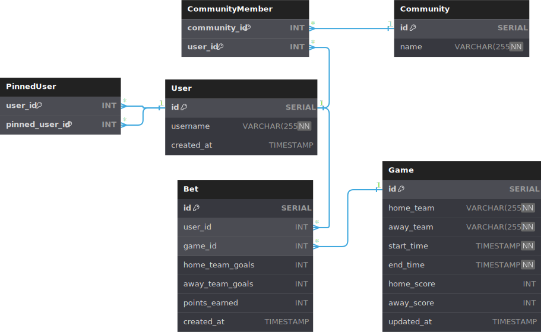
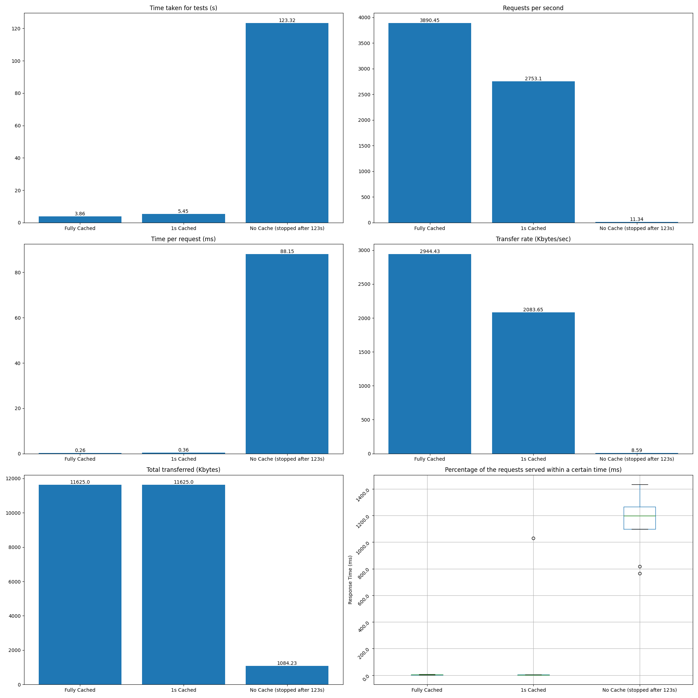

# tippspiel-next

_tippspiel-next_ wurde mit PostgreSQL, Prisma, Next.js und NextUI entwickelt.
Der Fokus lag in der Performance-Optimierung der Anwendung, insbesondere der
Datenbank.

# Performance Optimierungen

Um die Performance der Anwendung sinnvoll messen zu können, wurde auf die
Nutzung von Caches verzichtet. Nur in wenigen ausgewiesenen Benchmarks wurde ein Cache
eingesetzt, um den möglichen Performance-Gewinn zu demonstrieren.

## Datenbank


### Indizes
Durch die Verwendung von Indizes kann die Performance von Datenbankabfragen erheblich
verbessert werden. In _tippspiel-next_ wurden folgende Indizes erstellt:
```sql
CREATE INDEX idx_user_id_username ON "User"(id, username);
CREATE INDEX idx_community_member_user_id ON CommunityMember(community_id, user_id);
CREATE INDEX idx_bet_user_id ON Bet(user_id, game_id);
CREATE INDEX idx_ranked_users ON RankedUsersMV(community_id,user_id,ranked_user_position);
```
Dadurch können alle Abfragen in wenigen Millisekunden ausgeführt werden. 

### Materialized Views
Materialized Views sind eine Möglichkeit, die Performance von komplexen Abfragen aus 
mehreren Tabellen zu verbessern. In _tippspiel-next_ wurden zwei `materialized Views` für die Rangliste 
der Benutzer in einer Community erstellt.
```sql
CREATE MATERIALIZED VIEW UserTotalPoints AS
SELECT
    u.id AS user_id,
    u.username,
    CAST(COALESCE(SUM(B.points_earned), 0) AS INT) AS total_points
FROM
    "User" u
        LEFT JOIN
    Bet b ON u.id = b.user_id
GROUP BY
    u.id, u.username;

CREATE MATERIALIZED VIEW RankedUsersMV AS
SELECT
  CM.community_id,
  CM.user_id,
  U.username,
  COALESCE(UT.total_points, 0) AS total_points,
  CAST (ROW_NUMBER() OVER (PARTITION BY CM.community_id ORDER BY COALESCE(UT.total_points, 0) DESC, U.created_at, U.username) AS INT) AS ranked_user_position,
  CAST (RANK() OVER (PARTITION BY CM.community_id ORDER BY COALESCE(UT.total_points, 0) DESC, U.created_at) AS INT) AS rank
FROM
  CommunityMember CM
    JOIN
  "User" U ON CM.user_id = U.id
    LEFT JOIN
  UserTotalPoints UT ON CM.user_id = UT.user_id
ORDER BY ranked_user_position;
```
Diese zwei `materialized Views` verbessern die Performance der Rangliste-Abfragen 
signifikant (wenige Millisekunden). Allerdings wird die inkrementelle Aktualisierung der `materialized Views` nicht von
PostgreSQL unterstützt. Daher müssen die `materialized Views` manuell aktualisiert
werden. In _tippspiel-next_ wurden triggers verwendet, um die `materialized Views`
nach jeder Änderung in der Datenbank zu aktualisieren. Dies führt bei 2 Millionen Nutzern
leider zu einer Verzögerung von ca. 4-6 Sekunden pro Änderung (z.B. Aktualisierung Spielstand). 

Gelöst werden könnte dieses Problem durch die Verwendung von `incremental updates` für
`materialized Views`. Leider wird diese Funktion von PostgreSQL [nicht unterstützt](https://wiki.postgresql.org/wiki/Incremental_View_Maintenance).
> Incremental View Maintenance (IVM) is a technique to maintain materialized views which computes and applies only the incremental changes to the materialized views rather than recomputing the contents as the current REFRESH command does. This feature is not implemented on PostgreSQL yet.

Das würde die Aktualisierung der `materialized Views` auf wenige Millisekunden reduzieren.
Nur im Falle einer Änderung eines Spielergebnisses müsste die Rangliste neu berechnet werden, was etwa 4-6 Sekunden dauert.

## Backend

Next.js bietet die Möglichkeit, API-Endpoints zu erstellen, die sowohl serverseitig als
auch clientseitig verwendet werden können. Dies ermöglicht es bereits serverseitig 
alle persistenten Daten zu laden und an den Client zu senden. Dadurch wird die
Ladezeit der Anwendung erheblich reduziert. Weiters rendert Next.js auch schon Teile
der Benutzeroberfläche serverseitig, was die Ladezeit der Anwendung weiter reduziert.
## Frontend

Next.js kompiliert und minimiert den Code und Bilder automatisch. Auch dadurch wird die Ladezeit der
Website reduziert.


# Benchmarks
Die Benchmarks wurden mit dem Tool `Apache Benchmark` durchgeführt. Es wurde 15.000
sneakPreview-Leaderboard-Abfragen durchgeführt. Mit etwa 600ms bis 1300ms pro Abfrage
ist diese die teuerste Lese-Operation in der Anwendung. Hier finden Sie die Abfrage:
```sql
CREATE OR REPLACE FUNCTION generate_sneak_preview_leaderboard(p_community_id INT, logged_in_user_id INT)
    RETURNS TABLE (
                      f_username VARCHAR(255),
                      f_total_points INT,
                      f_ranked_user_position INT,
                      f_rank INT
                  )
AS
$$
BEGIN
    RETURN QUERY
        WITH
            RankedUsersMVOfCommunity AS (
                SELECT *
                FROM RankedUsersMV RU
                WHERE RU.community_id = p_community_id
            ),
            UserPosition AS (
                SELECT *
                FROM
                    RankedUsersMVOfCommunity
                WHERE
                    user_id = logged_in_user_id
                limit 1
            ),
            MaxPosition AS (
                SELECT MAX(ranked_user_position) AS max_rup FROM RankedUsersMV WHERE community_id = p_community_id limit 1
            ),
            PreviewUsers AS (
                /* logged in user */
                SELECT * FROM UserPosition
                UNION
                /* first three and last user */
                SELECT *
                FROM RankedUsersMVOfCommunity RUOC
                WHERE (RUOC.ranked_user_position <= 3 OR RUOC.ranked_user_position = (SELECT max_rup FROM MaxPosition))
                   OR ((SELECT ranked_user_position FROM UserPosition) >= 5 AND
                       (SELECT ranked_user_position FROM UserPosition) <= (SELECT max_rup - 2 FROM MaxPosition)
                    AND ABS(RUOC.ranked_user_position - (SELECT ranked_user_position FROM UserPosition)) = 1)
                   OR ((SELECT ranked_user_position FROM UserPosition) <= 4 AND RUOC.ranked_user_position <= 6)
                   OR ((SELECT ranked_user_position FROM UserPosition) > (SELECT max_rup - 2 FROM MaxPosition)
                    AND RUOC.ranked_user_position >= (SELECT max_rup - 3 FROM MaxPosition))
                   OR ((SELECT max_rup FROM MaxPosition) <= 7)
            )
        SELECT DISTINCT on (ranked_user_position)
            PU.username AS f_username,
            PU.total_points AS f_total_points,
            PU.ranked_user_position AS f_ranked_user_position,
            PU.rank AS f_rank
        FROM
            PreviewUsers PU
        ORDER BY
            ranked_user_position
        limit 7;
END;
$$
    LANGUAGE plpgsql;
```
Ausgehend darauf wurden dann die Benchmarks mit 15.000 Abfragen durchgeführt.  Es lief eine
einzelne Instanz der next.js-Anwendung (single threaded) und der PostgreSQL-Datenbank auf
einem 8-Kern-AMD-6850U-Prozessor mit 32 GB RAM. Die Datenbank wurde mit 2 Millionen User gefüllt.

Ich vergleiche
drei Varianten der API-Abfrage getestet: Persistenter Cache (Next.js Geschwindigkeit), 1s-
persistenter Cache und kein Cache. Die Ergebnisse sind in der folgenden Übersicht zu sehen:


## Interpretation
Da hier die teuerste Lese-Operation der Anwendung gemessen wurde, kann unter Nutzung des
1s-persistenten Caches die Anforderung mit 10.000 gleichzeitigen Benutzern erfüllt werden.
Unter der Annahme, dass jeder Nutzer eine Abfrage pro Sekunde durchführt, reicht es schon
aus, wenn 4 next.js-Instanzen und 1 PostgreSQL-Instanz aktiv sind.

# Mögliche Erweiterungen zur Verbesserung der Performance

## System Design


## Datenbank
Durch die Verwendung des  
[pq-ivm](https://github.com/sraoss/pg_ivm) Moduls können `incremental updates` für `materialized Views` genutzt werden.
Dies würde den Großteil der Aktualisierung der `materialized Views` auf wenige Millisekunden reduzieren.

## Microkernels
Microkernels können die Performance von Anwendungen durch die Reduktion der Abstraktionsschichten [verbessern](https://unikraft.org/docs/concepts/performance).

# Videos und Screenshots

# Wahl des Tech-Stacks

- **Docker**: Docker ermöglicht es, die Anwendung in einem isolierten Container zu
  betreiben.
- **PostgreSQL**: PostgreSQL ist ein relationales Datenbanksystem, welches eine gute
  Performance und Zuverlässigkeit bietet. Leider werden `incremental updates` von
  `materialized views` nicht unterstützt.
  Siehe [Performance Optimierungen](#performance-optimierungen).
- **Prisma**: Prisma ist ein ORM, welches ausgehend von einem laufenden
  Datenbanksystem API-Methoden generiert. Dadurch können Datenbankoperationen
  unkompliziert `type-safe` durchgeführt werden.
- **Next.js**: Next.js bietet eine einfache Möglichkeit React-Apps zu erstellen, die
  sowohl serverseitig als auch clientseitig gerendert wird. Somit kann sowohl das
  Backend als auch das Frontend mit einem einzigen Framework geschrieben werden.
- **NextUI**: NextUI ist ein React-Komponenten-Framework, welches auf TailwindCSS
  basiert. Es ermöglicht es, schnell und einfach ansprechende Benutzeroberflächen zu
  erstellen.

# Projektstruktur

```
> tree -L 2
├── benchmark: Contains data and charts related to performance benchmarks of the application.
│   ├── charts
│   └── data
├── db: Contains SQL scripts for
│   ├── 10_schema.sql: setting up the database schema
│   └── 20_data.sql: seeding data
├── prisma: Contains the Prisma configuration and schema files.
│   ├── dev.db
│   ├── schema.prisma
│   └── views
├── src: Contains the source code of the next.js application. 
│   ├── app: Contains the pages of the application.
│   ├── components: Contains React components used in the application.
│   ├── helper: Contains helper functions and utilities.
│   ├── lib: Contains library code or third-party libraries used in the application.
│   ├── pages/api: Contains the api components for the Next.js application. Each file corresponds to a route in the application.
│   ├── styles: Contains CSS style files.
│   └── types: Contains TypeScript type definitions.
├── docker-compose.yml: Contains the configuration for the Docker containers.
├── Dockerfile: Contains the configuration for the Docker image.
```

# Docker Setup
```zsh
> docker-compose up --build
> firefox http://localhost:5173/
```